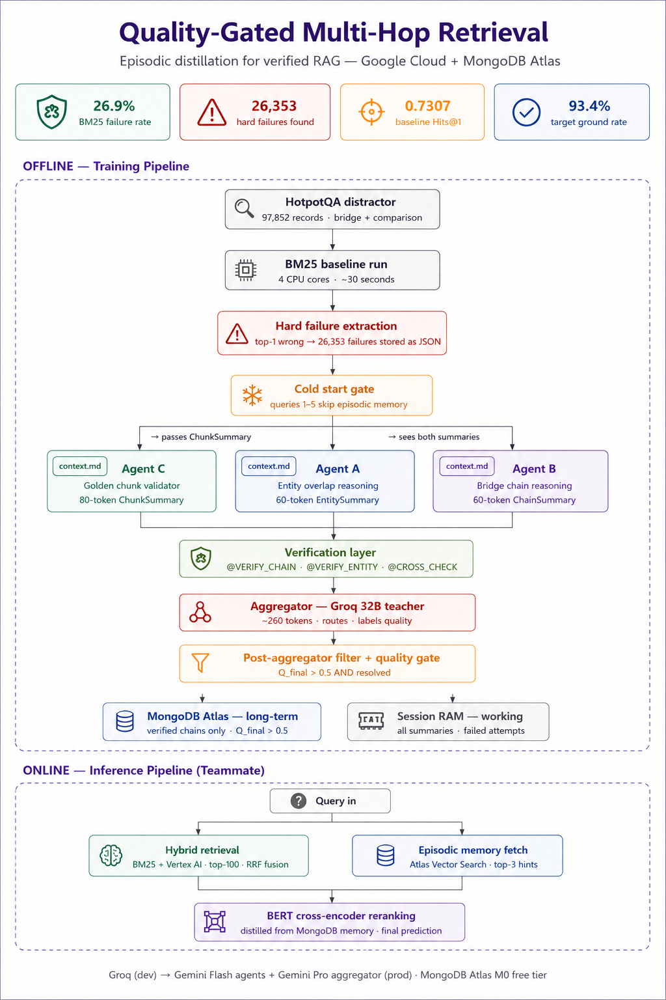

# Quality-Gated Multi-Hop Retrieval  
### Episodic Distillation for Verified RAG using Google Cloud + MongoDB Atlas


---

# Overview

This project implements a **quality-gated multi-hop retrieval pipeline** designed to improve retrieval performance on difficult BM25 failure cases using:
- episodic memory
- multi-agent reasoning
- verification-aware aggregation
- distilled reranking

The system is trained on **HotpotQA distractor** samples and focuses specifically on **hard retrieval failures** where BM25 retrieves incorrect top-1 results.

The architecture combines:
- **Gemini Flash agents**
- **Gemini Pro aggregation**
- **MongoDB Atlas episodic memory**
- **cross-encoder reranking**
- **verification-based filtering**

---

# Key Results

| Metric | Value |
|---|---|
| BM25 Failure Rate | **26.9%** |
| Hard Failures Extracted | **26,353** |
| Baseline Hits@1 | **0.7307** |
| Target Ground Rate | **93.4%** |

---

# System Architecture

The pipeline is divided into two stages:

1. **Offline Training Pipeline**
2. **Online Inference Pipeline**

---

# Offline — Training Pipeline

## 1. HotpotQA Distractor Dataset

The system starts with:
- **97,852 records**
- bridge + comparison questions

Dataset characteristics:
- multi-hop reasoning heavy
- retrieval-intensive
- suitable for hard negative mining

---

## 2. BM25 Baseline Run

A BM25 retrieval pass is executed over the dataset.

Purpose:
- identify retrieval misses
- extract top-1 wrong predictions
- build episodic failure memory

Runtime:
- ~30 seconds
- 4 CPU cores

---

## 3. Hard Failure Extraction

The pipeline extracts:
- queries where BM25 top-1 prediction is incorrect
- gold-vs-wrong retrieval mismatches

Extracted failures:
- **26,353 hard failures**

Stored as:
- structured JSON records

---

## 4. Cold Start Gate

Early queries bypass episodic memory retrieval.

Purpose:
- prevent noisy memory injection
- stabilize early retrieval behavior

Rule:
- queries 1–5 skip episodic memory usage

---

# Multi-Agent Reasoning Layer

The architecture uses three specialized agents.

Each agent:
- receives a shared `context.md`
- performs constrained reasoning
- outputs compressed summaries

This design minimizes:
- token overflow
- context fragmentation
- memory growth

---

## Agent A — Entity Overlap Reasoner

Purpose:
- detect entity mismatches between:
  - gold documents
  - BM25 wrong retrievals

Output:
- `EntitySummary`
- ~60 tokens

Focus:
- bridge entities
- overlap reasoning
- retrieval mismatch diagnosis

---

## Agent B — Bridge Chain Reasoner

Purpose:
- infer missing multi-hop reasoning chains
- reconstruct bridge relationships

Output:
- `ChainSummary`
- ~60 tokens

Focus:
- reasoning continuity
- bridge-hop alignment
- latent retrieval paths

---

## Agent C — Golden Chunk Validator

Purpose:
- validate supporting evidence chunks
- compress useful retrieval evidence

Output:
- `ChunkSummary`
- ~80 tokens

Focus:
- chunk relevance
- support quality
- hallucination reduction

---

# Verification Layer

Before aggregation, outputs pass through verification checks:

- `@VERIFY_CHAIN`
- `@VERIFY_ENTITY`
- `@CROSS_CHECK`

Purpose:
- reject weak reasoning traces
- ensure structural consistency
- improve memory quality

---

# Aggregator — Groq 32B Teacher

The aggregator:
- combines reasoning summaries
- validates cross-agent agreement
- labels output quality

Responsibilities:
- routing
- quality scoring
- structured synthesis

Output budget:
- ~260 tokens

---

# Post-Aggregation Quality Gate

Only high-confidence outputs are persisted.

Condition:

```python
Q_final > 0.5 AND resolved
```

Purpose:
- prevent noisy episodic memories
- maintain retrieval precision
- improve distillation quality

---

# Memory Architecture

## MongoDB Atlas — Long-Term Memory

Stores:
- verified reasoning chains only

Condition:
- `Q_final > 0.5`

Used for:
- episodic retrieval augmentation
- future reranking hints

---

## Session RAM — Working Memory

Stores:
- temporary summaries
- failed attempts
- active reasoning traces

Purpose:
- lightweight short-term coordination

---

# Online — Inference Pipeline

The inference pipeline uses both:
- retrieval
- episodic memory augmentation

---

## 1. Hybrid Retrieval

Combines:
- BM25
- Vertex AI retrieval

Strategy:
- top-100 retrieval
- RRF fusion

Purpose:
- improve recall
- reduce lexical-only failures

---

## 2. Episodic Memory Fetch

Uses:
- MongoDB Atlas Vector Search

Retrieves:
- top-3 memory hints

Purpose:
- inject historical failure corrections
- recover missing bridge reasoning

---

## 3. BERT Cross-Encoder Reranking

Final reranking stage:
- distilled from episodic memory traces

Purpose:
- produce final prediction
- improve ranking precision

---

# Prompting Strategy

The system uses:
- structured markdown prompting
- constrained output schemas
- compressed reasoning summaries

Inference-time controls:
- `max_output_tokens`
- `top_k`
- `top_p`
- `stop_sequences`

This improves:
- output consistency
- token efficiency
- reasoning stability

---

# Tech Stack

| Component | Technology |
|---|---|
| LLM Agents | Gemini Flash |
| Aggregator | Gemini Pro |
| Dev Teacher Model | Groq 32B |
| Vector Memory | MongoDB Atlas |
| Retrieval | BM25 + Vertex AI |
| Reranking | BERT Cross-Encoder |
| Storage | MongoDB Atlas M0 |
| Dataset | HotpotQA Distractor |

---

# Design Goals

- Improve multi-hop retrieval
- Recover BM25 hard failures
- Build reusable episodic memory
- Maintain bounded token usage
- Enable scalable agent orchestration
- Support retrieval distillation pipelines

---

# Future Work

- adaptive memory pruning
- reinforcement-style retrieval correction
- dynamic agent routing
- graph-based bridge reasoning
- retrieval confidence calibration
- memory-aware reranker finetuning

---

# Citation / Inspiration

- HotpotQA
- Retrieval-Augmented Generation (RAG)
- Self-RAG inspired summarization
- Episodic memory architectures
- Verification-aware retrieval systems
- Multi-agent reasoning pipelines