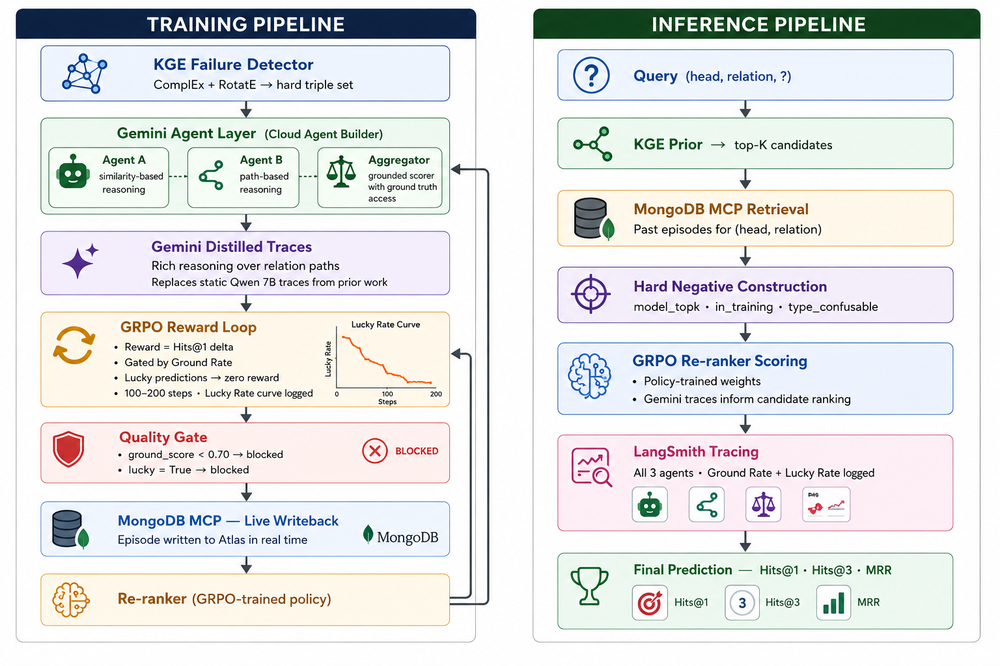

# GREM
markdown_content = """# Gemini-Driven Knowledge Graph Embedding (KGE) Enhancement Pipeline

This repository contains the architecture and implementation for an advanced Knowledge Graph Completion (KGC) framework. The system combines Knowledge Graph Embeddings (KGE), multi-agent reasoning layers powered by Google Gemini, and Group Relative Policy Optimization (GRPO) to construct a highly accurate, dynamic training and inference pipeline.

## Architecture Overview

The system is split into two primary operational phases:
1. **Training Pipeline**: An autonomous RLHF-style (via GRPO) feedback loop that discovers hard triples, uses Gemini-driven agent rationales to build high-quality traces, and optimizes a custom Re-ranker policy while enforcing strict quality control gates.
2. **Inference Pipeline**: A high-throughput, multi-stage retrieval and ranking pipeline that leverages learned KGE priors, historical episodes from MongoDB, hard-negative mitigation, and policy-driven scoring to deliver state-of-the-art predictive metrics (Hits@1, Hits@3, MRR).

---

## 1. Training Pipeline

The training pipeline focuses on policy optimization using distilled LLM rationales to train a specialized Re-ranker.

### Step 1: KGE Failure Detector
* **Models**: ComplEx + RotatE
* **Function**: Identifies weak points or structural gaps in static embeddings. Triples that these models fail to confidently or correctly predict are routed into a **hard triple set** for specialized agent-driven intervention.

### Step 2: Gemini Agent Layer (Cloud Agent Builder)
A multi-agent orchestration setup deployed via Cloud Agent Builder consisting of:
* **Agent A (Similarity-based reasoning)**: Analyzes contextual and semantic similarity across entities.
* **Agent B (Path-based reasoning)**: Traverses multi-hop relational paths within the graph to establish connectivity.
* **Aggregator**: A grounded scoring component with real-time access to the ground truth dataset to validate agent findings.

### Step 3: Gemini Distilled Traces
* **Purpose**: Generates rich, deep reasoning chains over relation paths.
* **Upgrade**: These dynamic, high-fidelity traces fully replace static, less expressive Qwen 7B traces used in prior iterations, dramatically improving downstream policy learning.

### Step 4: GRPO Reward Loop
* **Optimization Framework**: Group Relative Policy Optimization (GRPO).
* **Reward Metric**: Driven by the change in Hits@1 accuracy (`Hits@1 delta`).
* **Guardrails**: Gated directly by the **Ground Rate**. "Lucky predictions" (correct answers arrived at via faulty or hallucinatory reasoning paths) are penalized with a **zero reward**.
* **Monitoring**: Tracks progress over 100–200 steps, plotting and logging a downward-sloping **Lucky Rate Curve** as the model learns structurally sound reasoning.

### Step 5: Quality Gate
Acts as a strict filtering layer before writing data back to storage.
* **Condition 1**: If `ground_score < 0.70`, the episode is **BLOCKED**.
* **Condition 2**: If `lucky == True`, the episode is **BLOCKED**.

### Step 6: MongoDB MCP — Live Writeback
* Validated training episodes that clear the Quality Gate are written back to a **MongoDB Atlas** cluster in real time using the Model Context Protocol (MCP).

### Step 7: Re-ranker (GRPO-trained policy)
* The optimized policy weights are continuously updated and outputted directly into both the inference pipeline and back into the aggregator framework for ongoing iterative alignment.

---

## 2. Inference Pipeline

The inference pipeline handles live link prediction queries sequentially to find the missing element in a triple.

### Step 1: Query Input
* Accepts missing-link queries formatted as standard triple completions: `(head, relation, ?)` or `(?, relation, tail)`.

### Step 2: KGE Prior Extraction
* Utilizes the pre-trained embedding space to rapidly filter and surface the **top-K candidates** from the global entity pool.

### Step 3: MongoDB MCP Retrieval
* Fetches historical episodes and past conversational/reasoning traces matching the specific `(head, relation)` context from MongoDB Atlas.

### Step 4: Hard Negative Construction
* Dynamically constructs challenging negative samples using three distinct vectors:
  * `model_topk`: High-scoring false positives from the base model.
  * `in_training`: Negatives surface-mined during the GRPO loop.
  * `type_confusable`: Entities that match the expected schema/type definition but are contextually incorrect.

### Step 5: GRPO Re-ranker Scoring
* Applies the custom **Policy-trained weights** optimized during the training pipeline.
* Integrates distilled Gemini traces to inform candidate scoring, adjusting candidate logits based on structural correctness.

### Step 6: LangSmith Tracing
* End-to-end telemetry captures metrics across all 3 agents.
* Real-time production analytics are maintained by logging continuous **Ground Rate** and **Lucky Rate** metrics to a dashboard.

### Step 7: Final Prediction Evaluation
* The top-ranked entities are evaluated against core information retrieval metrics:
  * **Hits@1**: Precision at top 1 position.
  * **Hits@3**: Presence within top 3 recommendations.
  * **MRR**: Mean Reciprocal Rank across the candidate space.

---

## Configuration & Environment Setup

### Prerequisites
* Python 3.10+
* MongoDB Atlas Cluster (with MCP support enabled)
* Google Gemini API Credentials
